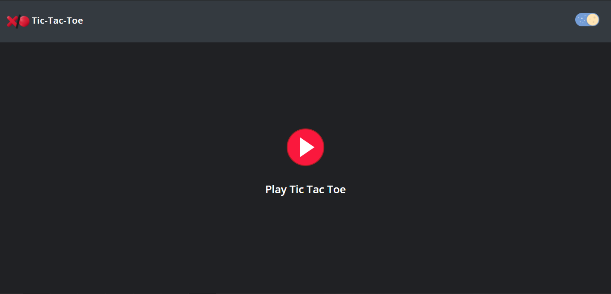
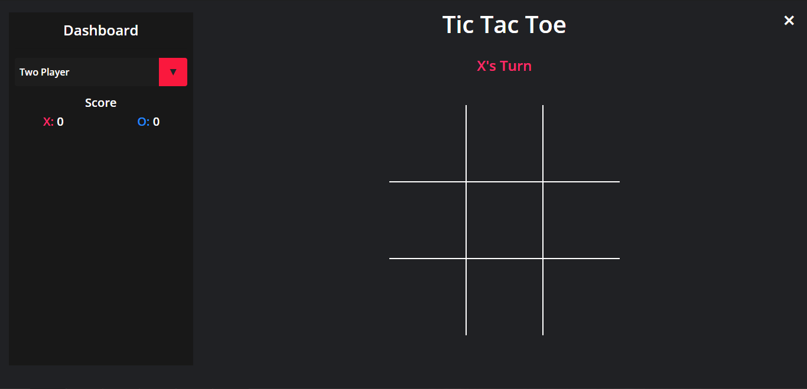
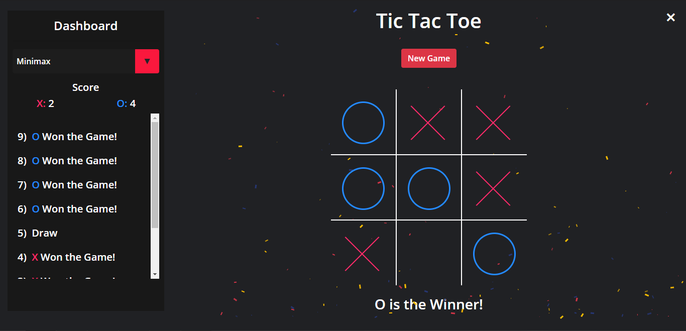
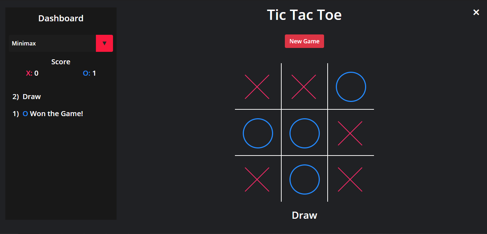
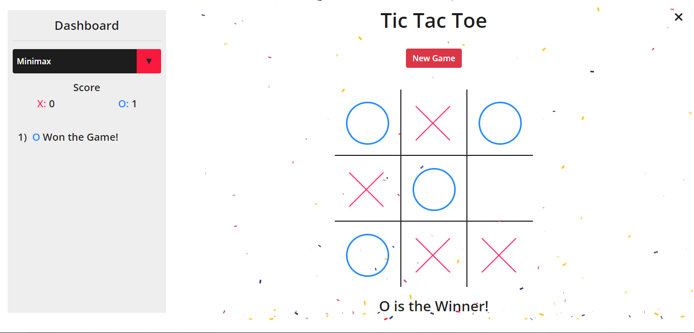

# Tic-Tac-Toe-Using-AI
Web-based Tic-Tac-Toe game to play against various Artificial Intelligence algorithms

## AI Algorithms
1. Minimax Algorithm
2. Alpha-Beta Pruning Algorithm
3. Hill Climbing Algorithm

## Preview

## Requirements
1. Git Version Control (Download & Install)  
`https://git-scm.com/downloads`
2. Node JS (LTS) (Download & Install)  
`https://nodejs.org/en/download/`
3. Mongo DB (v4.4.3) (Download & Install)  
`https://www.mongodb.com/try/download/community`
4. Angular 10.x.x (Run Command)  
`npm install -g @angular/cli@latest`
5. Nodemon (Run Command)  
`npm install -g nodemon`

## How to Install & Run the App
1. Clone the repository by running this command where you want the project to be saved.  
`git clone https://github.com/KaranJagtiani/Tic-Tac-Toe-Using-AI.git`
2. Install Node Modules.  
i) In the **root directory**, run the command:  
`npm install`  
ii) Go to the **'angular-src'** directory and again run:  
`npm install`
3. In the **root directory**, run the command:  
`nodemon`
4. Go to the **'angular-src'** directory and run the command:  
`ng serve`
5. Open a browser and go to the following URL:  
`localhost:4200`

### Happy Coding!
